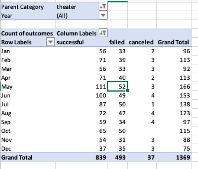
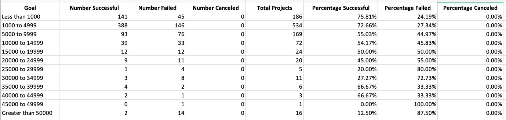
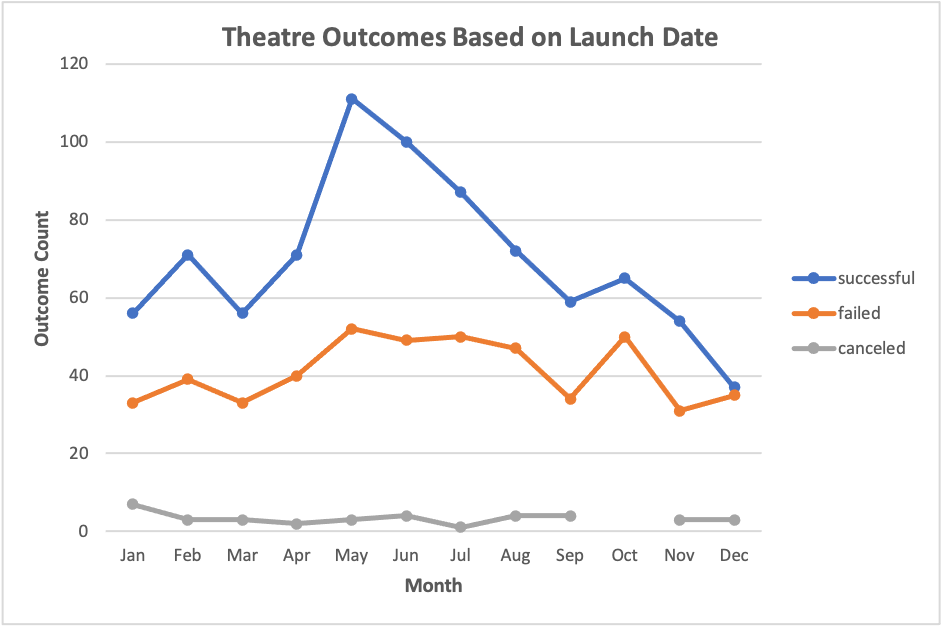
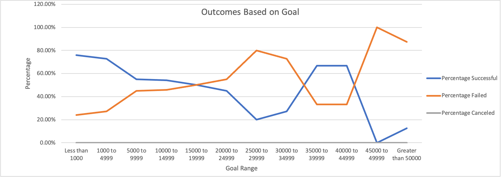

# Excel Analysis of Kickstarter Campaigns Across the Globe
Performing Excel analysis on Kickstarter campaigns and their data, to map trends and produce meaningful conclusions.

## Overview of Project
Louise has created a kickstarter campaign for her play, *Fever*. In order to decipher trends and draw meaningflul conclusions, she is requiring the help of a data analyst to comb through, analyze and visualize the data of other kickstarter campaigns. In this project, the launch date, goals and outcomes of various theatre/play campaigns were analyzed using pivot tables, charts and excel calculations. 

### Purpose
By using the values and charts obtained through this excel analysis, Louise will be able to understand the outcomes of various campaigns in relation to their launch dates and funding goals. As a result, Louise wil be able to draw meaningful conclusions about her own play based on the trends of others. 

## Analysis and Challenges
### Analysis of Outcomes Based on Launch Date
To draw conclusions about theatre outcomes based on launch date, a pivot table (shown below) was created. The pivot table summarizes the count of successful, failed and canceled theatre campaigns based on the month they were launched. The pivot table also includes two filters that allow for easier read of outcomes based on specific parent categories and years. However, for the sake of this project, we have filtered the table to only look at theatre campaigns.

###### Pivot Table: Theatre Outcomes by Launch Date

### Analysis of Outcomes Based on Goals
A table (shown below) was curated to understand the outcomes of theatre plays based on funding goals. For this analysis, we looked at 12 different goal ranges and the number of plays that were successful, failed or canceled in each range. The COUNTIFS function was used to gather the number of plays that fit into each category. 

###### Excel Table: Outcomes Based on Goals

### Challenges and Difficulties Encountered
The first pivot table that I created was not showing the same values as the reference table in the module notes. Although I correctly put the corresponding titles into the filter, column, row and values sections, the numbers were not adding up. I had to go back to the original Kickstarter data set and make sure that everything was in place. Although I didn't register it as a solution at the time, I decided to clear the filters one more time. Turns out, I didn't clear them properly the first time. Even a simple task such as removing filters can sometimes be overlooked in the midst of the thousands of data cells. While completing this project, I learned the importance of precision. Missing even a single character in a function can yield improper values. 

## Results
### Conclusions
- Based on the chart outlining theatre outcomes and launch date (shown below, left), we can conclude that theatre campaigns launched in May and June had higher success rates. Theatre campaigns launched in December had the lowest success rate.
- Plays that had a funding goal under $5000 were more successful than plays that were over (shown below, right). The overall trend shows that as funding goal increases, successful percentage decreases and failure percentage increases. 
                                        

### Limitations and Recommendations
- After working with the first data set in the pivot table, we said that campaigns in May and June had higher success. However, it is also important to note that in general more campaigns were launched in those months. Instead of looking at percentages or ratios of success to failure, we simply looked at the count of success and failures. Yes the number of successful campaigns is larger in May than December, but the number of failures is also larger in May. 

we cant really conclude much, because in general more campaigns were launched in May and June

For all data values, tables and charts, refer to 
